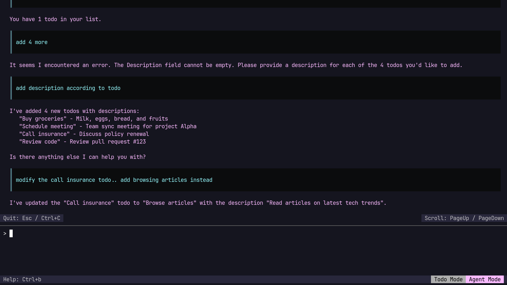

# GODO 



#### An AI Agent built for the Terminal to boost your productivity.
## Installation

### Using the install script (Recommended)

```bash
curl -sS https://raw.githubusercontent.com/biisal/godo/main/install | bash
```

### Using Go

```bash
go install github.com/biisal/godo@latest
```
## What makes GODO unique?
1. **AI AI AI** - Nowdays AI is eveywhere :) why not use the free gemini api and not to waste it :)
2. **Accessibility** - Godo is terminal based so just open the terminal and run it.. you dont need any browser or app to manage your todos
3. **UI** - GODO comes with a simple Good Looking UI 
4. **Fast** - GODO is lightweight and it uses live streaming to fetch the data from the gemini api and render to UI
5. **Agent** - The Ai Agent can manage your todos for you so you dont need to manage things manually

## More Features
1. **Search** - You can search for your todos by the title
2. **Mark** - You can mark your todos as done or pending


3. **Multiline Text** - You can add multiline description to your todos


### Usage

#### Configuration & Environment Variables

Godo can be configured using a `.env` file either in the directory you run the command from, or globally at `~/.local/share/godo/.env` (which is created automatically upon first run). 

The following environment variables are supported:
- `OPENAI_API_KEY`: Your model provider API Key.
- `OPENAI_MODEL`: The model name to use (e.g. `gpt-4o-mini`).
- `OPENAI_BASE_URL`: Custom API base URL if using compatible endpoints instead of OpenAI natively.

**Demo: Using Local Ollama**
To use Godo completely free and locally via [Ollama](https://ollama.com/), configure your environment variables like this:
```bash
OPENAI_API_KEY="ollama"
OPENAI_MODEL="llama3.2"  # or whichever reasoning model you prefer
OPENAI_BASE_URL="http://127.0.0.1:11434/v1"
```

#### Running Godo

If you installed via the script, it should automatically add Godo to your PATH. If not, add the following to your shell config file (e.g. `~/.bashrc`, `~/.zshrc`):

```bash
export PATH="$PATH:$HOME/.godo/bin"
```

If you installed via `go install`, make sure your Go bin directory is in your PATH (`export PATH="$PATH:$HOME/go/bin"`).
Then Restart your terminal and run:
```bash
godo
```

### Help
Pressing ctrl+b will open the keybindings list

### Contributing

You can contribute by [opening an issue](https://github.com/biisal/godo/issues/new/choose) or [contributing directly](https://github.com/biisal/godo).

Thank you ! Bye :)
