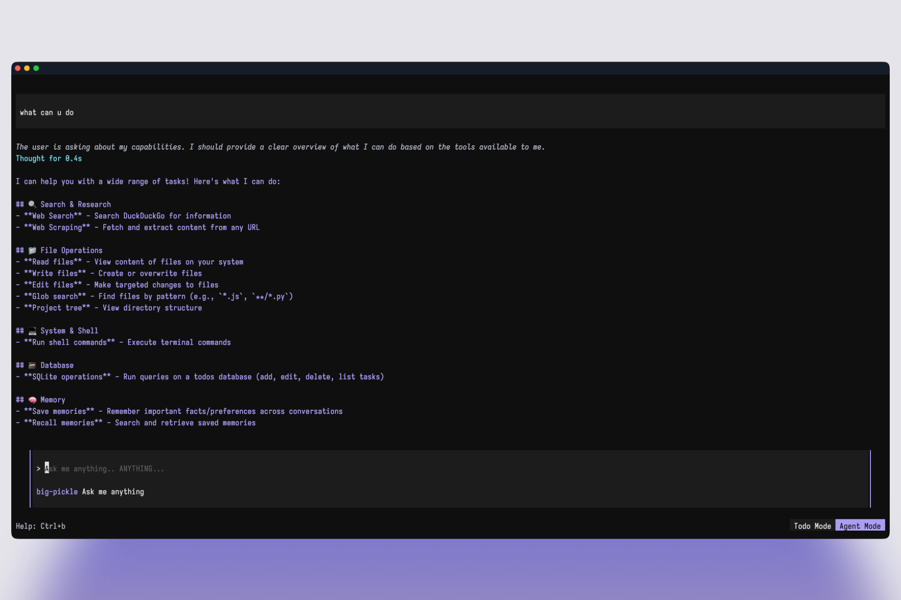
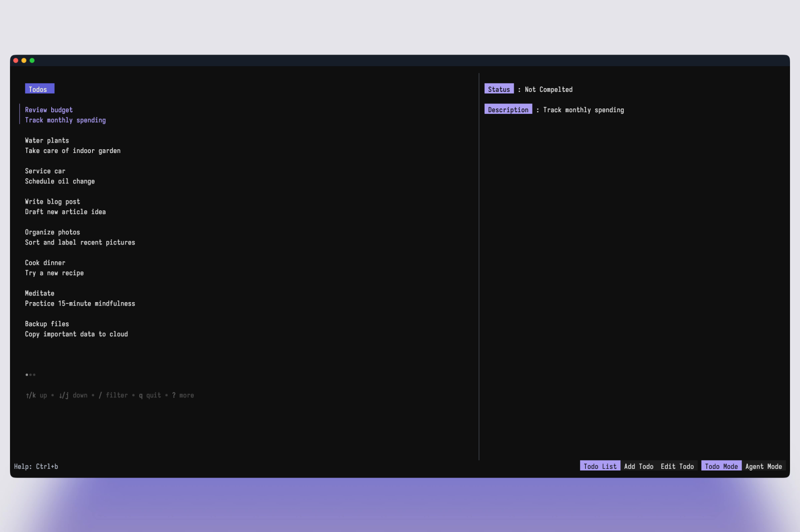
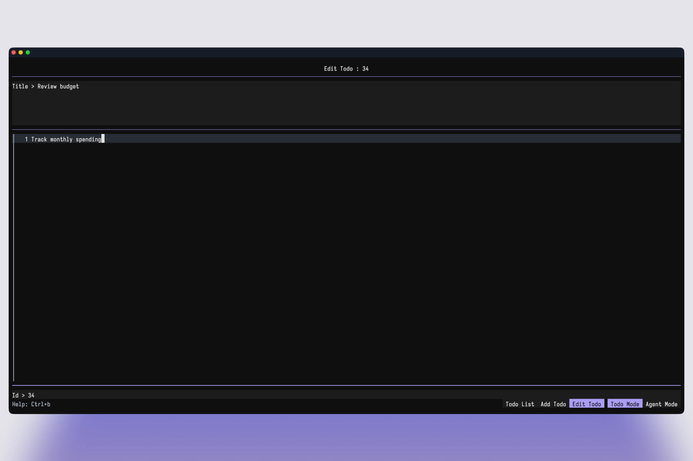

# Godo - AI agent that can build almost many things



#### A fully autonomous AI Agent built for the Terminal to handle your everyday tasks.
## Installation

### Using the install script (Recommended)

```bash
curl -sS https://raw.githubusercontent.com/biisal/godo/main/install | bash
```

### Using Go

```bash
go install github.com/biisal/godo@latest
```
## What makes GODO unique?
1. **True AI Agent** - Godo acts autonomously with a rich set of tools (shell execution, file reading, web search, SQL execution) to get things done without heavy lifting from you.
2. **Accessible & Offline-First** - Godo is built natively for the terminal. No browsers, no heavy Electron apps. Plus, it seamlessly supports local reasoning models via Ollama.
3. **Beautiful TUI** - A polished, responsive Terminal User Interface that supports streaming responses and visually rich Markdown rendering.
4. **Context-Aware Memory** - The agent remembers your past interactions, saving critical context to give you better, personalized assistance across sessions.
5. **Fast & Responsive** - Extremely lightweight, built in Go, and uses real-time event streaming for instant UI feedback without blocking.

## Capabilities & Tools
1. **Shell Execution** - The agent can run arbitrary bash commands locally on your machine. Be careful!
2. **File System Access** - Read, write, and list directories directly from the chat.
3. **Database Queries** - Connect to SQLite databases and execute queries right from the terminal.
4. **Web Search** - Search DuckDuckGo directly for up-to-date reasoning and fact-checking.
5. **Persistent Memory** - The agent dynamically remembers your preferences and context using local SQLite storage across sessions.
6. **Task Management** - Search, add, and mark your todos as done or pending directly in the chat.



7. **Multiline Todos** - Add multiline descriptions to your todos for better task context.



8. **Auto Update** - Keep Godo up to date easily with the built-in update command (`godo update`).
9. **Markdown Rendering** - Beautifully rendered markdown in the terminal for better readability.

### Usage

#### Configuration & Environment Variables

Godo can be configured using a `.env` file either in the directory you run the command from, or globally at `~/.local/share/godo/.env` (which is created automatically upon first run). 

The following environment variables are supported:
- `OPENAI_API_KEY`: Your model provider API Key.
- `OPENAI_MODEL`: The model name to use (e.g. `gpt-4o-mini`).
- `OPENAI_BASE_URL`: Custom API base URL if using compatible endpoints instead of OpenAI natively.

**Demo: Using Local Ollama**
To use Godo completely free and locally via [Ollama](https://ollama.com/), configure your environment variables like this:
```bash
OPENAI_API_KEY="ollama"
OPENAI_MODEL="llama3.2"  # or whichever reasoning model you prefer
OPENAI_BASE_URL="http://127.0.0.1:11434/v1"
```

#### Running Godo

If you installed via the script, it should automatically add Godo to your PATH. If not, add the following to your shell config file (e.g. `~/.bashrc`, `~/.zshrc`):

```bash
export PATH="$PATH:$HOME/.godo/bin"
```

If you installed via `go install`, make sure your Go bin directory is in your PATH (`export PATH="$PATH:$HOME/go/bin"`).
Then Restart your terminal and run:
```bash
godo
```

### Help
Pressing ctrl+b will open the keybindings list

### Contributing

You can contribute by [opening an issue](https://github.com/biisal/godo/issues/new/choose) or [contributing directly](https://github.com/biisal/godo).

Thank you ! Bye :)
