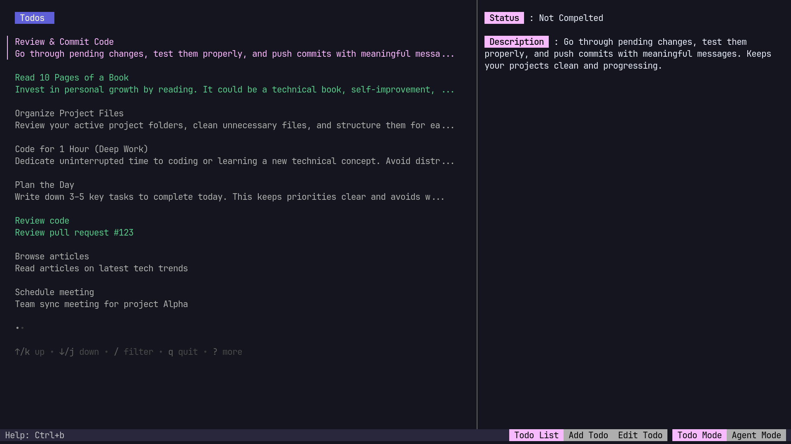
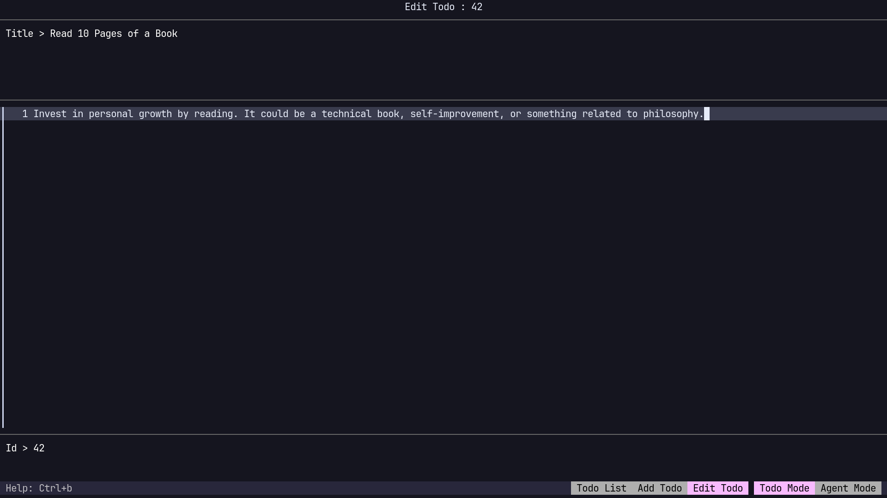

# GODO 


#### An AI Agent built for the Terminal to boost your productivity.
## Installation

```bash
go get github.com/biisal/godo
```
## What makes GODO unique?
1. **AI AI AI** - Nowdays AI is eveywhere :) why not use the free gemini api and not to waste it :)
2. **Accessibility** - Godo is terminal based so just open the terminal and run it.. you dont need any browser or app to manage your todos
3. **UI** - GODO comes with a simple Good Looking UI 
4. **Fast** - GODO is lightweight and it uses live streaming to fetch the data from the gemini api and render to UI
5. **Agent** - The Ai Agent can manage your todos for you so you dont need to manage things manually

## More Features
1. **Search** - You can search for your todos by the title
2. **Mark** - You can mark your todos as done or pending




3. **Multiline Text** - You can add multiline description to your todos



### Usage

Add the following to your shell config file (e.g. `~/.bashrc`, `~/.zshrc`):

```bash
export PATH="$PATH:$HOME/go/bin"
```
Then Restart your terminal and run:
```bash
godo
```

### Help
Pressing ctrl+b will open the keybindings list

### Contributing

You can contribute by [opening an issue](https://github.com/biisal/godo/issues/new/choose) or [contributing directly](https://github.com/biisal/godo).

Thank you ! Bye :)
